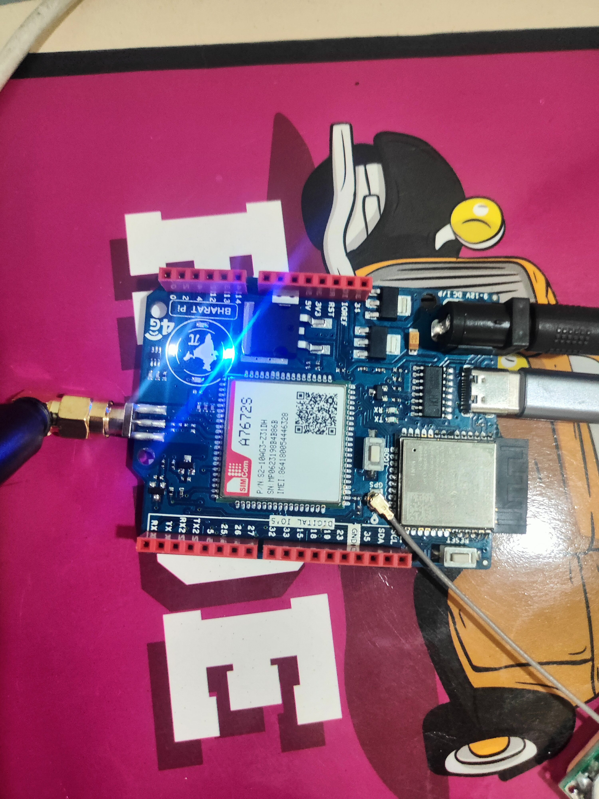
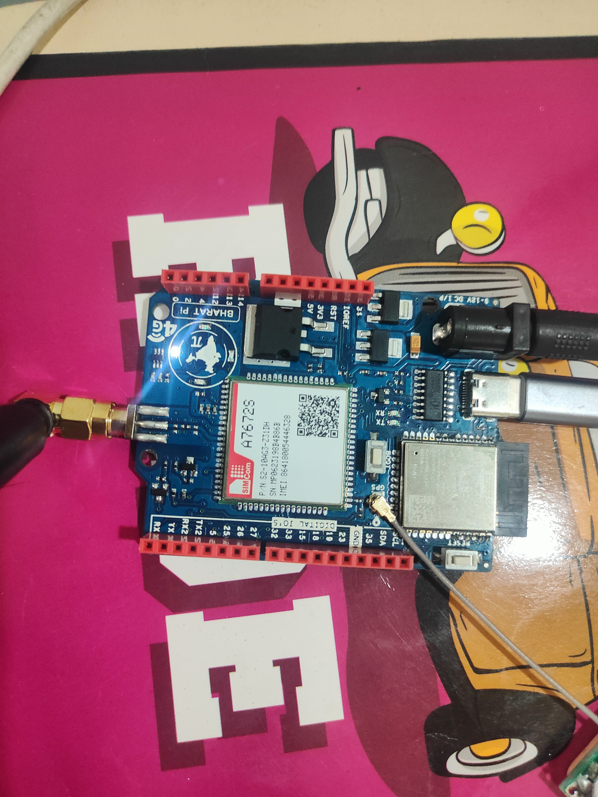
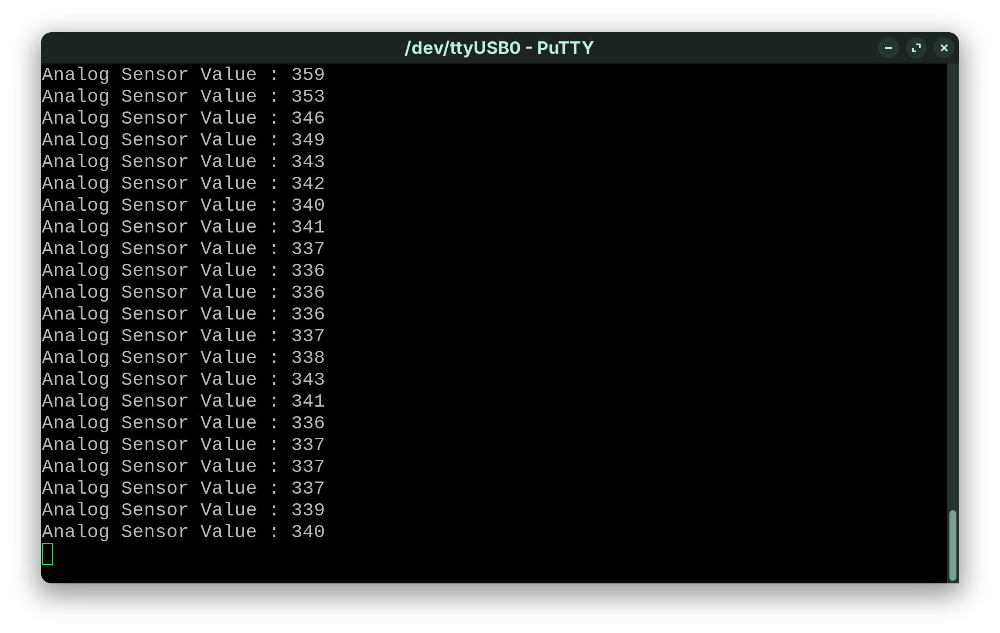
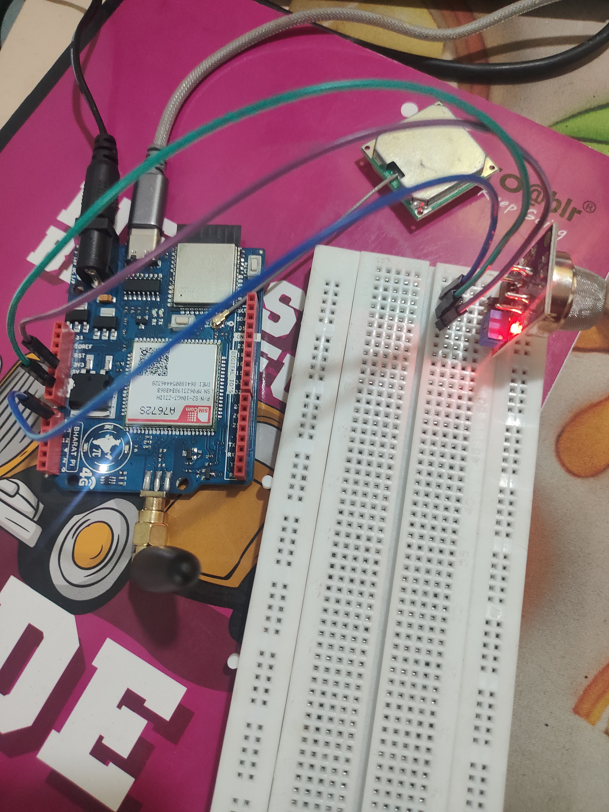
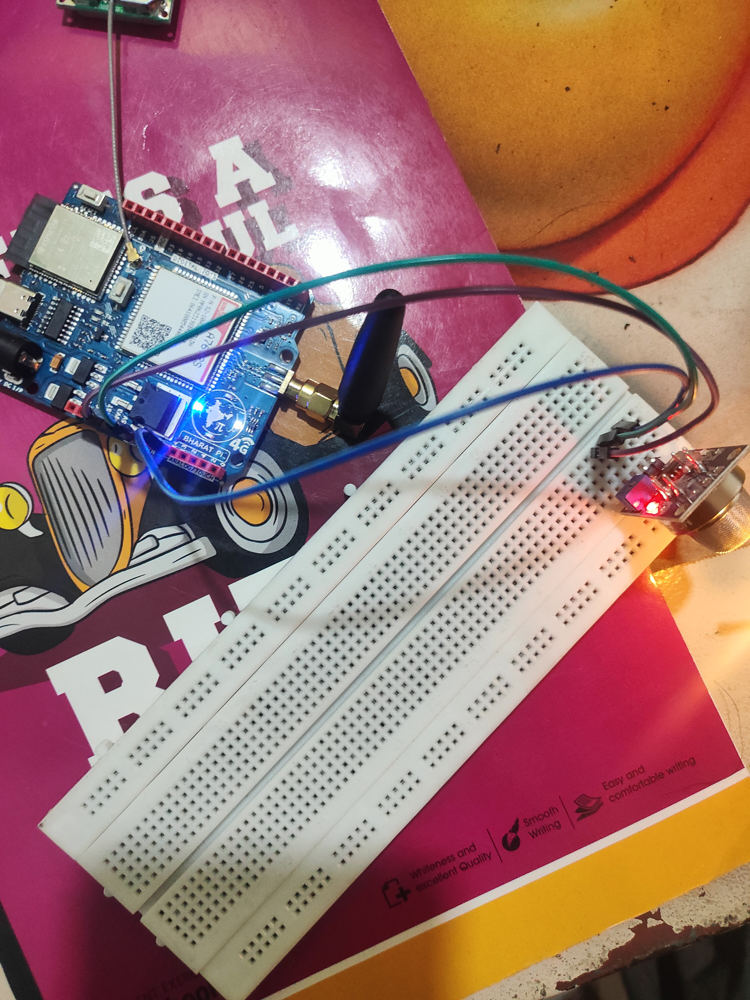

# This is the README.md file for the programs

---

## [LED Blink](LED_Blink/LED_Blink.ino)

### LED ON 

### LED OFF 

---

## Gas Sensor MQ135

### Serial monitor Output

### Air Quality OK 

### Air Quality BAD 

