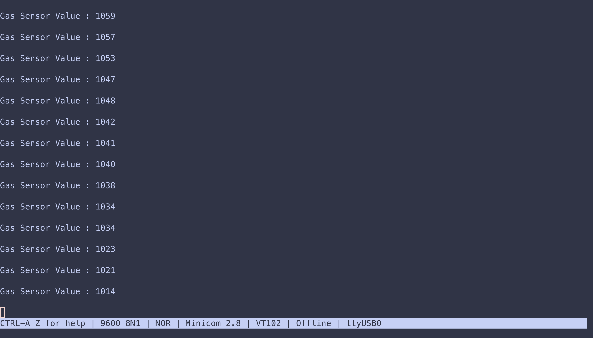
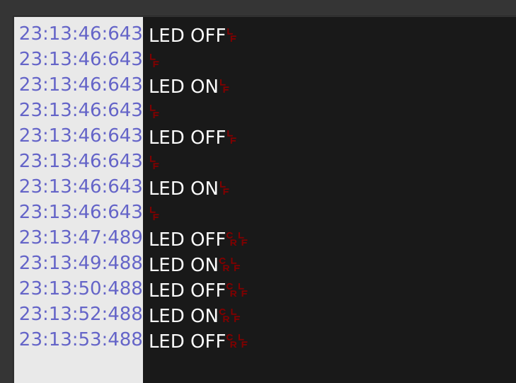

<!-- START doctoc generated TOC please keep comment here to allow auto update -->
<!-- DON'T EDIT THIS SECTION, INSTEAD RE-RUN doctoc TO UPDATE -->

- [This is the README.md file for the programs](#this-is-the-readmemd-file-for-the-programs)
  - [LED Blink](#led-blink)
    - [LED ON](#led-on)
    - [LED OFF](#led-off)
  - [Gas Sensor MQ135](#gas-sensor-mq135)
    - [Serial monitor Output](#serial-monitor-output)
    - [Air Quality OK](#air-quality-ok)
    - [Air Quality BAD](#air-quality-bad)
  - [Servo Motor](#servo-motor)
  - [BMP280 Temperature, Pressure and Altitude](#bmp280-temperature-pressure-and-altitude)
  - [MPU9250 Accelerometer, Gyroscope and Magnetometer](#mpu9250-accelerometer-gyroscope-and-magnetometer)
  - [MPU9250 and BMP280 Together](#mpu9250-and-bmp280-together)
  - [Voltage Sensor](#voltage-sensor)
  - [GPS Module (L76X) Test](#gps-module-l76x-test)
- [Teensy Programs (The actual Microcontroller that is used)](#teensy-programs-the-actual-microcontroller-that-is-used)
  - [LED Blink with Serial Output](#led-blink-with-serial-output)
  - [MPU9250 and BMP280 output](#mpu9250-and-bmp280-output)
  - [MQ135 Gas Sensor](#mq135-gas-sensor)
  - [GPS Module](#gps-module)

<!-- END doctoc generated TOC please keep comment here to allow auto update -->

# This is the README.md file for the programs

---

## [LED Blink](LED_Blink/LED_Blink.ino)

### LED ON 

### LED OFF 

---

## Gas Sensor MQ135

### Serial monitor Output

### Air Quality OK 

### Air Quality BAD 

--- 

## Servo Motor

 

---

## BMP280 Temperature, Pressure and Altitude 

--- 

## MPU9250 Accelerometer, Gyroscope and Magnetometer

--- 

## MPU9250 and BMP280 Together

--- 

## Voltage Sensor 

--- 

## GPS Module (L76X) Test 

--- 

# Teensy Programs (The actual Microcontroller that is used)

--- 

## LED Blink with Serial Output 

---

## MPU9250 and BMP280 output 

--- 

## MQ135 Gas Sensor 

--- 

## GPS Module 

