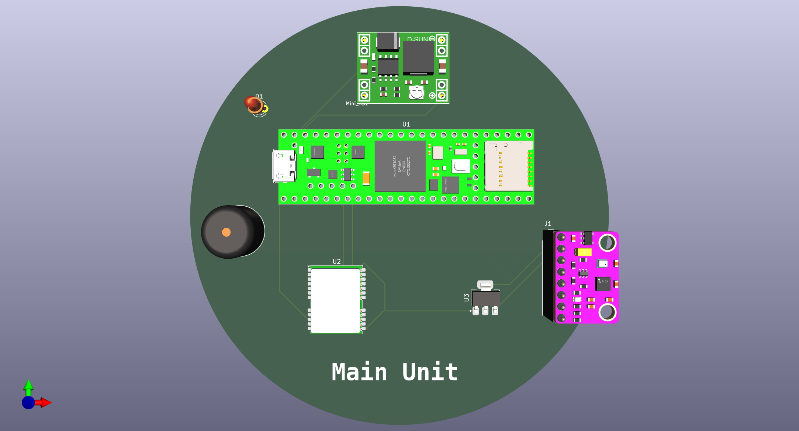
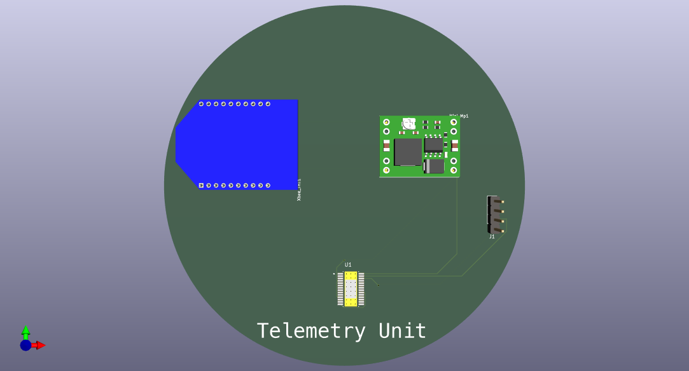
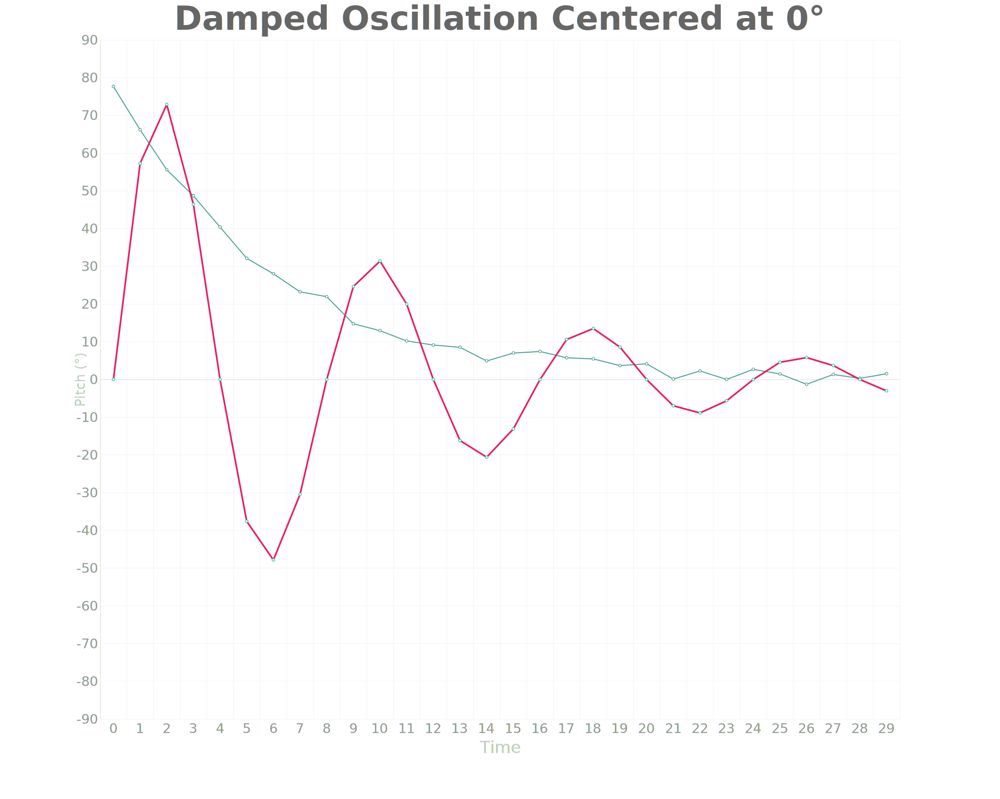

<!-- START doctoc generated TOC please keep comment here to allow auto update -->
<!-- DON'T EDIT THIS SECTION, INSTEAD RE-RUN doctoc TO UPDATE -->

- [Team Avadhi](#team-avadhi)
  - [Hardware used (for now)](#hardware-used-for-now)
  - [Programs we did for testing the hardware](#programs-we-did-for-testing-the-hardware)
  - [Teensy Programs](#teensy-programs)
  - [3D Model of PCB (Prototype)](#3d-model-of-pcb-prototype)
    - [Main Unit](#main-unit)
    - [Telemetry Unit](#telemetry-unit)
    - [PID Test](#pid-test)
      - [Image](#image)

<!-- END doctoc generated TOC please keep comment here to allow auto update -->

# Team Avadhi 

This is the official repository of **Team Avadhi**. 

## Hardware used (for now)

1. [Teensy 4.1](Teensy_Pinout.png)
2. MQ-135 Air Quality Sensor
3. Servo Motor 
4. Mini MP1584 Regulators 
5. BMP280 Temperature and Pressure sensor. 
6. MPU9250 Accelerameter, Gyroscope, and Magnetometer

## Programs we did for testing the hardware

1. [LED Blink](Programs/README.md)
2. [Gas Sensor MQ135](Programs/README.md)
3. [Servo motor](Programs/README.md)
4. [BMP280](Programs/README.md)
5. [MPU9250](Programs/README.md)
6. [MPU9250 and BMP280 Together (or GY-91 Program)](Programs/README.md)
7. [Voltage Sensor Output](Programs/README.md)
8. [GPS Module L76X](Programs/README.md)

## Teensy Programs 
1. [LED Blinking with Serial Output](Programs/README.md)
2. [MPU9250 and BMP280 Test](Programs/README.md)
3. [MQ135 Gas Sensor](Programs/README.md)
4. [GPS Test](Programs/README.md)

## 3D Model of PCB (Prototype)

### Main Unit 

### Telemetry Unit 

### PID Test

[Code](./pid_graph/src/bin/main.rs)

[Pseudocode](./pid_pseudocode.md)

#### Image

## Attitude Control Notes 

[Attitude Control Notes](./attitude_control_system.md)
