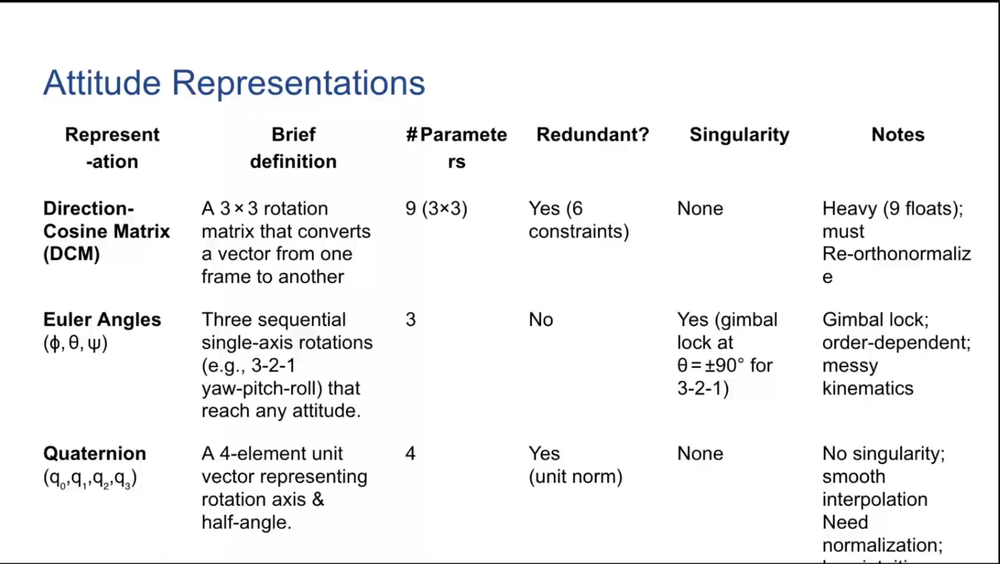
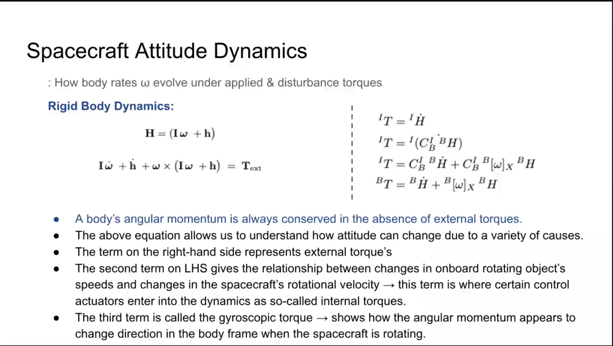
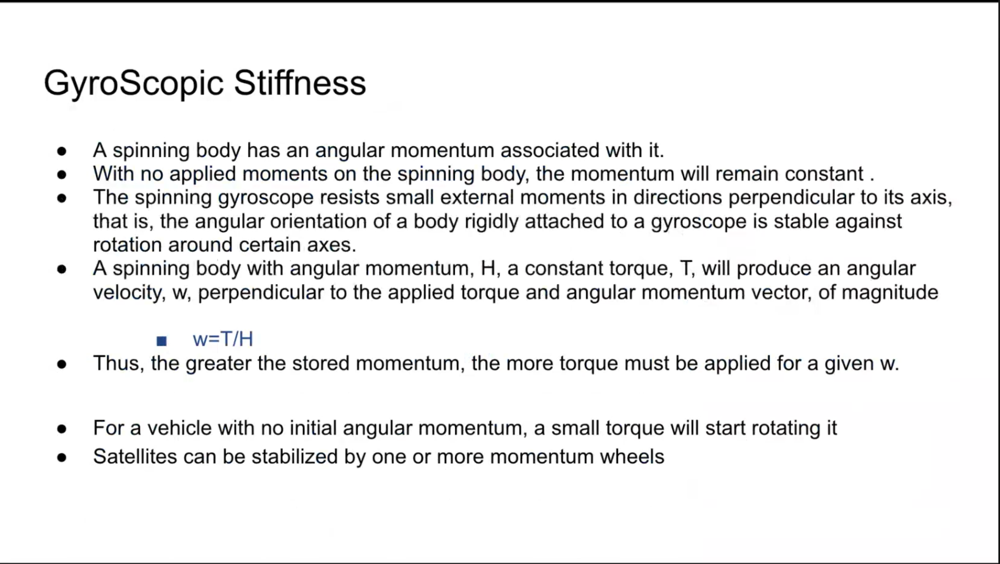
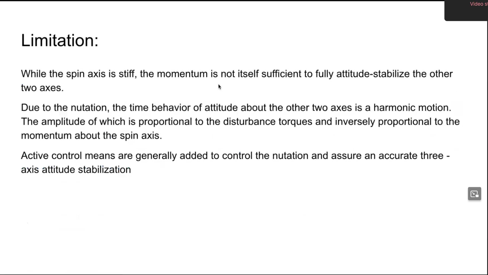
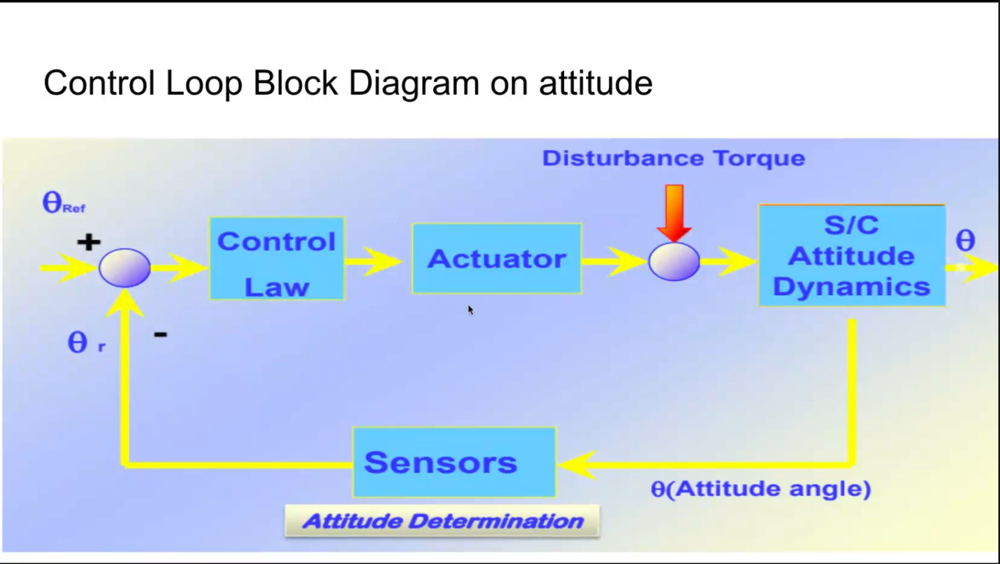
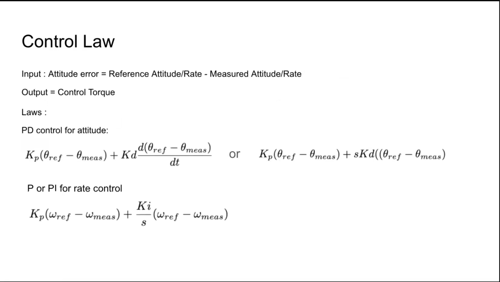
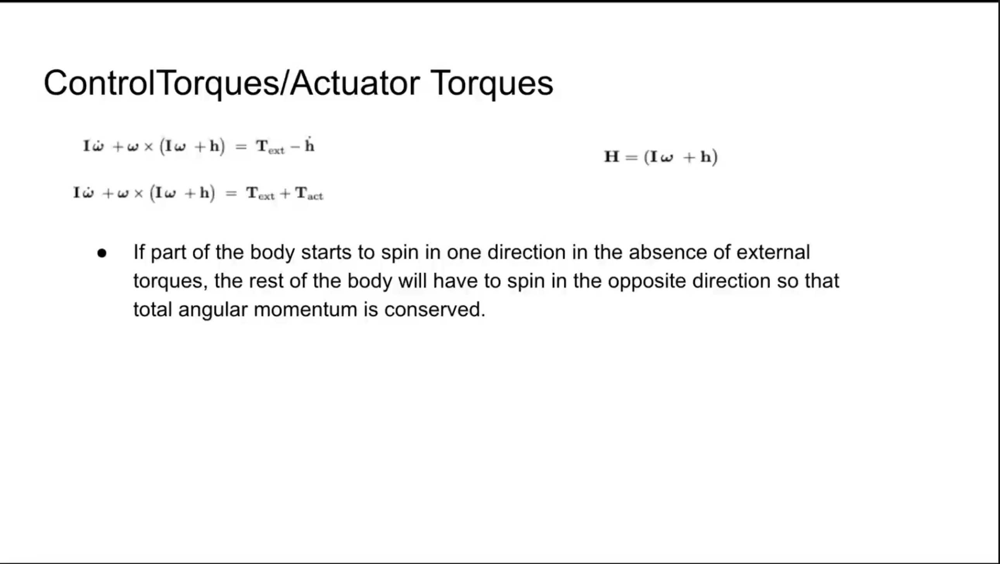
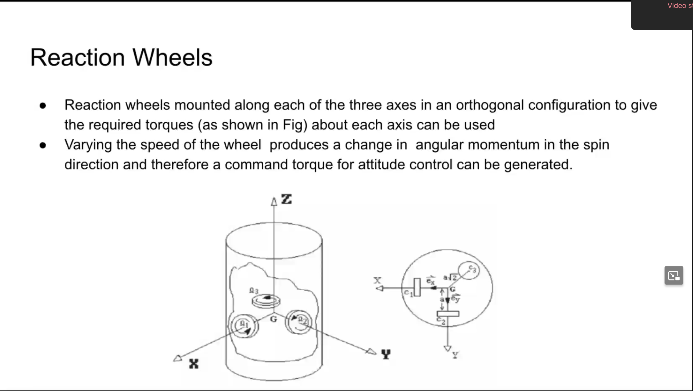
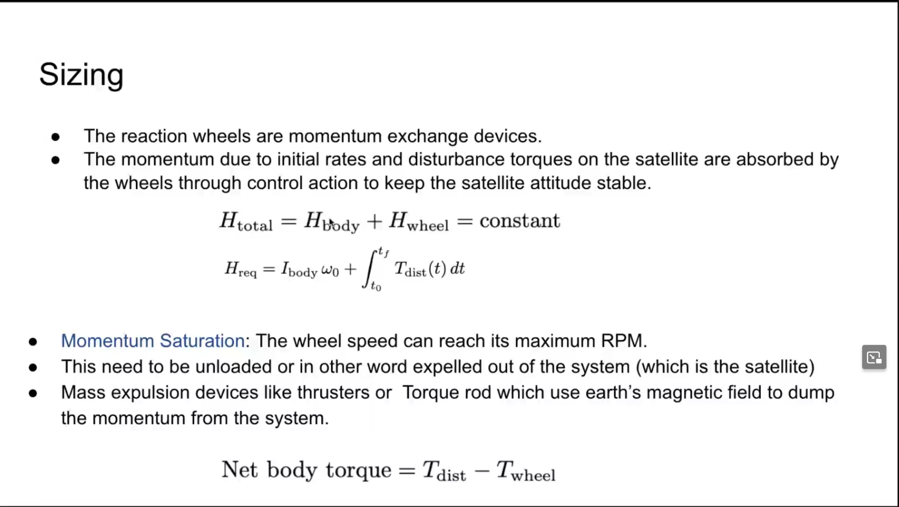
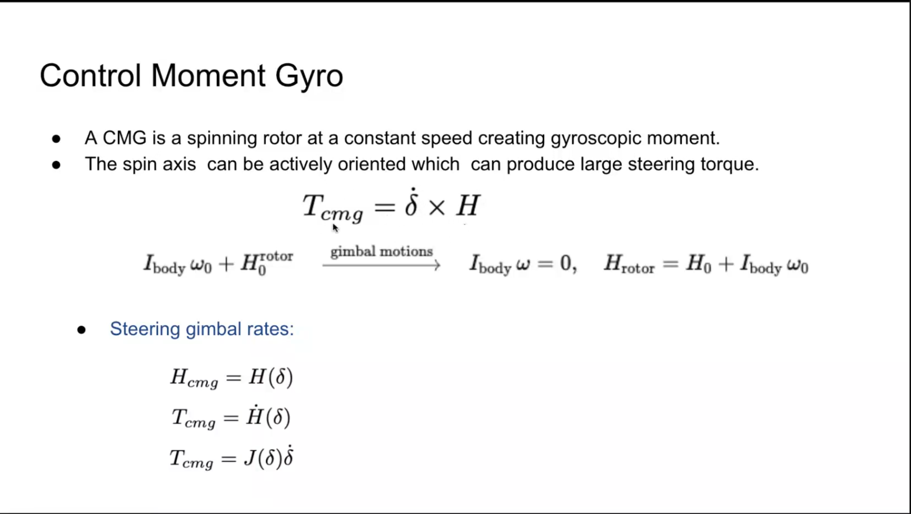

# Attitude Control System FUndamentals

## Satellite's Degrees of Freedom

1. 3 Translational DOF 
2. 3 Rotational DOF 

- **Attitude** is the 3D orientation of vehicle wrt a specified reference frame.

### Why is Attitude important

The instruments or antenna must be pointed in specific directions
- Communication Satellites must point their antennas.
- Remote Sensing Satellites need image of a particular area.

**Orbital Maneuvering** : Thrust Direction 

## Earth Centered Inertial and Fixed Frames 

|Frame|Definition|Axes and Origin|
|---|---|---|
|ECI (Earth-centered inertial) | Non-rotating frame fixed in space | Origin : Earth's center, X towards vertical equinox, Z along Earth' mean rotation, Y completes RH system.|
|ECEF (Earth-centered Earth-fixed) | Rotate with earth , origin at Earth's center | Origin : Earth's center, X to 0 Ion, Z along Earth Axis , Y completes RH |

## Attitude Representations 

## CANSAT Stabilization

The initial rates (tumbling) from launcher must be damped out. The attitude (Angular position) and angular rates should be controlled. 

### Stabilization 

1. **Passive**

Use dynamics to stabilize the satellite requiring less control effort.

Eg : Spin Stabilization 

2. **Active**

Corrective torques are applied using actuators in response to disturbance torques. 

There is no overall stabilizing torque present to resist the disturbance torques.

## Spacecraft Attitude Dynamics 

## Gyroscopic Stiffness 

## Limitation 

## Aerodynamic Stability in CANSAT 

A CANSAT hanging under a parachute has restoring force 

$$
T_{rest} = Dbsin(\theta)
$$

$$
I \ddot{\theta} + Db \theta = 0
$$

**Natural Frequency**

$$
\omega_{n} = \sqrt {\frac {Db}{I}}
$$

$$
f_n = \frac {\omega_n}{2 \pi}
$$

## Control Loop 

## Sensors 

| Sensor   | Output it gives    |
|--------------- | --------------- |
| 3-axis Gyro   | Body Rate (deg/s)   |
| 3-axis Magnetometer   | Earth-field vector -> Heading   |
| 3-axis Accelerometer   | Acceleration -> gravity vector after Chute opens   |
| GNSS Rx   | Position, Velocity, UTC   |

## Control Law 

## Control Torques / Actuator Torques

# Reaction Wheels 

## Sizing 

## Control Movement Gyro 

If they ask about the sizing tell about the momentum and torque capabilities. 

## Disturbance Torques

$$
T_{disturbance} = T_{gg}  + T_{aero} + T_{srp} + T_{mag}
$$

Near-surface (1 km) $T_{aero}$ will dominate 

|Disturbance | Torque Expression |
|---|---|
|Gravity-gradient | $T_{gg} = (3 \frac {\mu}{r^3})(I \times \hat{r})$|
| Aerodynamic | $T_{aero} = (r_{CP} - r{CG} \times (\frac {1}{2} \rho V^2 C_D A \perp \hat {V}))$ |
| Solar Radiation Pressure | $T_{srp} = (r_{CP} - r_{CG}) \times (P_s C_r A \perp \hat {s})$ |
| Residual Magnetic dipole | $T_{mag} = m \times B$ |

